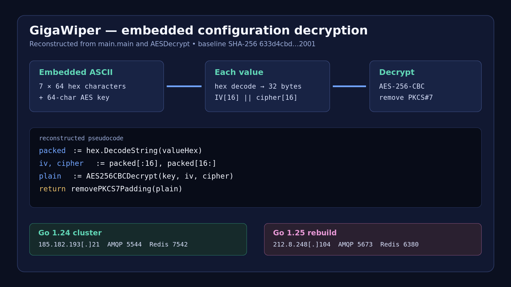
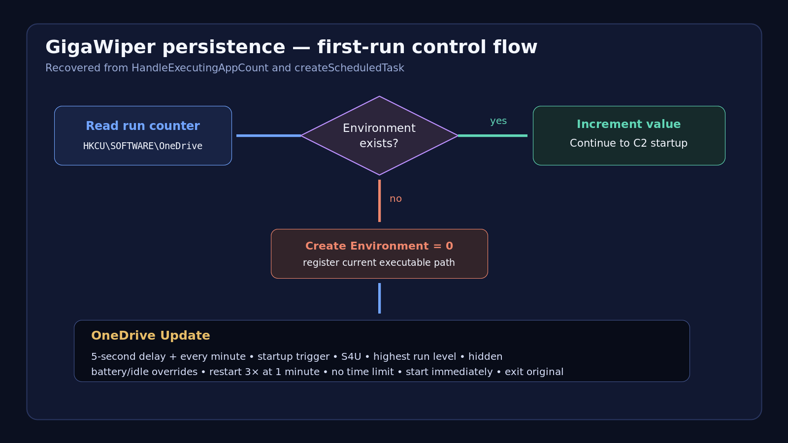
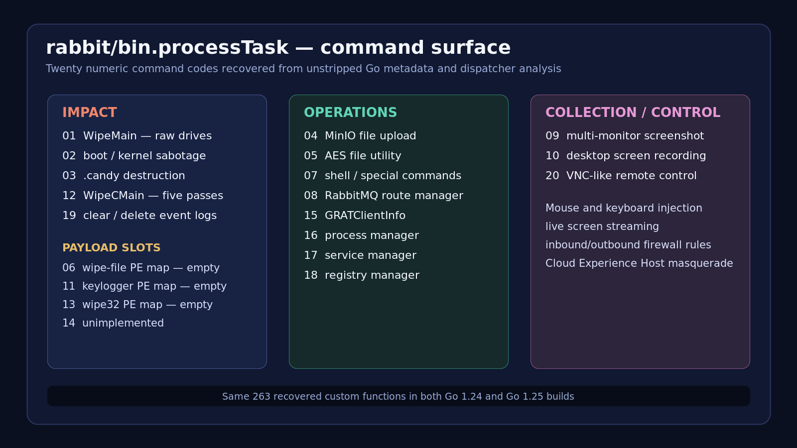

# Code-level analysis



## Scope and method

The four Windows PE files were analyzed exclusively as data in a
network-disabled, read-only REMnux workflow. Go metadata, package names, source
file paths, symbols, PE structure, static strings, and selected x86-64
disassembly were recovered with `redress`, `radare2`, `readpe`, Detect It Easy,
ExifTool, and standard hashing tools. No dynamic execution or emulation was
performed.

The binaries retain extensive Go metadata. This exposes 263 non-runtime
functions and source paths under the module name `rabbit`, including:

```text
rabbit/bin/connector.go
rabbit/bin/utility.go
rabbit/bin/worker.go
rabbit/tools/tool_wipec_main
rabbit/tools/tool_ran_main/bin
rabbit/tools/tool_clear_event_log_main
rabbit/tools/tool_vnc_main
main/main.go
```

## Configuration decryption

`main.main` contains seven 64-character lowercase hexadecimal values followed
by a 64-character AES key. Each value decodes to:

```text
16-byte IV || 16-byte AES-CBC ciphertext
```

The values are stored in AMQP-then-Redis order. Recovered pseudocode:

```go
func AESDecrypt(valueHex, keyHex string) string {
    packed := hex.DecodeString(valueHex)
    key := hex.DecodeString(keyHex)
    iv, ciphertext := packed[:16], packed[16:]
    plaintext := AES256CBCDecrypt(key, iv, ciphertext)
    return removePKCS7Padding(plaintext)
}

redis.Init(
    AESDecrypt(redisHost, key),
    AESDecrypt(redisPort, key),
    AESDecrypt(redisPassword, key),
)
amqp.ConnectToServer(
    AESDecrypt(amqpUsername, key),
    AESDecrypt(amqpPassword, key),
    AESDecrypt(amqpHost, key),
    AESDecrypt(amqpPort, key),
)
```

The implementation checks the decoded input is at least 16 bytes, uses its first
16 bytes as the IV, decrypts the remainder in CBC mode, and removes padding
using the final plaintext byte. `extract_config.js` reproduces the operation but
emits only network endpoints; authentication values and decryption keys are
deliberately excluded.

## Persistence



`HandleExecutingAppCount` uses:

```text
HKCU\SOFTWARE\OneDrive
value: Environment
```

`createScheduledTask` launches PowerShell with a script that registers
`OneDrive Update`. The exact options recovered from the PE are materially more
specific than a simple one-minute task:

- one-time trigger five seconds in the future, repeated every minute;
- a second trigger at system startup;
- current user principal with `S4U` logon and `Highest` run level;
- hidden task, starts on battery, does not stop on idle/battery transitions;
- three one-minute restart attempts and no execution time limit;
- starts the task immediately after registration.

## Destructive disk logic


`WipeCMain` performs five sequential raw-drive overwrite passes:

```text
Pass 1: 0x00
Pass 2: nominally random
Pass 3: 0x00
Pass 4: 0xFF
Pass 5: 0x00
```

The overwrite buffer is 10 MiB (`0xA00000`). A code-level defect sharply
qualifies the apparent strength of pass 2: both recovered random-write
implementations call `crypto/rand.Read` with a one-byte slice, then copy only
that byte into `buffer[0]`. The freshly allocated Go buffer otherwise remains
zero-filled. This repeats once per full chunk (and once for a remainder), so
the “random” pass is effectively another zero pass with one random leading byte
per write. The `0xFF` writer, in contrast, loops across the complete buffer.

Simplified reconstruction:

```go
func WriteRandToDrive(drive *os.File, remaining uint64) {
    buffer := make([]byte, 0xA00000) // initialized to zeros
    for remaining > 0 {
        one := []byte{0}
        if _, err := cryptorand.Read(one); err != nil {
            one[0] = 1
        }
        buffer[0] = one[0]           // only one byte is randomized
        n := min(remaining, uint64(len(buffer)))
        drive.Write(buffer[:n])
        remaining -= n
    }
}
```

This conclusion is based on register setup immediately before
`crypto/rand.Read` in both `tool_wipec_main.WriteRandToDrive` and
`tool_wipe_main.WriteRandToDrive`: slice length and capacity are each `1`.

## Boot sabotage and recovery inhibition

The command-2 path shells out to:

```text
bcdedit /set {default} recoveryenabled No
bcdedit /set {default} bootstatuspolicy IgnoreAllFailures
reagentc /disable
```

It then takes ownership, grants `Everyone:F`, and deletes critical boot files,
including `winload.exe`, `winload.efi`, `ntoskrnl.exe`, and `bootmgr` from
multiple Windows boot paths. Additional registry commands disable automatic
reboot and Windows maintenance/update restart behavior.

## Event-log destruction

Command 19 invokes `wevtutil.exe cl` for `Application`, `Setup`, `System`,
`ForwardedEvents`, and `Security`. If clearing Security fails, the malware
targets:

```text
C:\Windows\System32\winevt\Logs\Security.evtx
```

The fallback is not limited to command-line tools. Native Windows security APIs
enable `SeTakeOwnershipPrivilege`, `SeBackupPrivilege`, and
`SeRestorePrivilege`; take ownership; construct an ACL granting full access to
Everyone; and delete the log file.

## Collection and remote control

Recovered packages and symbols implement:

- single screenshots through GDI (`BitBlt`/DIB creation);
- MJPEG screen recording under `C:\ProgramData\output`;
- keyboard and mouse injection through `robotgo`, `SendInput`, cursor movement,
  and window-message APIs;
- VNC-like remote desktop handling with inbound/outbound firewall rules;
- process, service, registry, file, and system-information management;
- MinIO-compatible object upload;
- shell execution;
- file encryption/decryption and destructive `.candy` encryption.

The destructive encryption path generates a random AES key and IV but does not
preserve or transmit them in the recovered implementation. It is therefore
destructive even though it resembles extortion tooling.

## Embedded PE slots



The dispatcher contains PE-mapping command slots for a file wiper (6),
keylogger (11), and elevated 32-bit wiper (13). The analyzed builds do not
contain populated embedded PE payloads in those slots. Command 14 is
unimplemented. These are capabilities anticipated by the dispatcher, not
observed embedded payloads, and should not be presented as executed behavior
without corroborating runtime evidence.

## Static-analysis limitations

- Runtime reachability and operator use of any command cannot be established
  without dynamic or telemetry evidence.
- Network protocols and decrypted endpoints are statically clear, but no
  connection was attempted.
- Source code shown here is reconstruction from metadata and disassembly, not
  original developer source.
- The standalone raw-drive wiper and third-party Crucio/FlockWiper samples
  referenced by Microsoft were not present locally and were not analyzed here.
