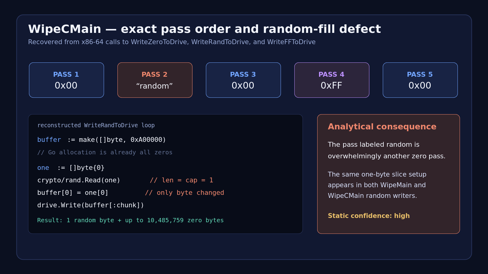

# GigaWiper static-analysis overview

## Executive assessment

GigaWiper is a destructive, Go-based Windows backdoor that combines persistent
remote administration with several independently selectable impact mechanisms:
raw physical-drive wiping, boot sabotage, and irreversible file encryption.
Microsoft Threat Intelligence identified the activity in October 2025 and
published its code-level analysis on July 9, 2026, noting that GigaWiper is also
tracked as BLUERABBIT by Google Threat Intelligence Group and Binary Defense.

This investigation statically analyzed the four backdoor instances supplied in
this directory. Their SHA-256 values exactly match the four backdoors published
by Microsoft. No sample was executed, emulated, or allowed network access.

### Principal additional findings

1. **Configuration network mapping.** All four hard-coded AES configurations
   were decoded to identify their AMQP/Redis endpoints, including a second
   cluster at `212.8.248[.]104:5673/6380`. Authentication material and
   decryption keys are intentionally omitted. A credential-free offline
   extractor is included in [`code/extract_config.js`](code/extract_config.js).
2. **Three samples are one executable build with different configurations.**
   The `633d`, `ce9a`, and `f622` samples differ in only 563–569 bytes, all
   confined to PE-header/build-ID data and the encrypted configuration. Their
   executable logic is otherwise byte-identical.
3. **The fourth sample is a later toolchain rebuild.** `9706` moves from Go
   1.24.12 to Go 1.25.4 and changes C2 configuration, but retains the same 263
   recovered custom functions and module dependency surface.
4. **The command-12 pass order is exact:** zero, nominally random, zero,
   `0xFF`, zero. Its “random” pass inherits the same defect Microsoft documented
   for the original wiper: only the first byte of each 10 MiB zero-filled buffer
   is randomized. The allegedly more secure multi-pass operation is therefore
   less random than its messages imply.
5. **Persistence and log destruction are more aggressive than their short
   descriptions suggest.** The scheduled task uses S4U/highest privileges,
   hidden and battery/idle overrides, immediate start, startup and one-minute
   triggers, and restart behavior. Security-log deletion includes native
   ownership and ACL manipulation after `wevtutil` fails.

## Sample matrix

| SHA-256 (prefix) | Size | Compiler | AMQP | Redis |
|---|---:|---|---|---|
| `633d4cbd…2001` | 10,412,544 | Go 1.24.12 | `185.182.193[.]21:5544` | `185.182.193[.]21:7542` |
| `ce9ad5f6…c913` | 10,412,544 | Go 1.24.12 | `185.182.193[.]21:5544` | `185.182.193[.]21:7542` |
| `f622ed85…5bfd` | 10,412,544 | Go 1.24.12 | `185.182.193[.]21:5544` | `185.182.193[.]21:7542` |
| `9706a192…0683` | 10,507,776 | Go 1.25.4 | `212.8.248[.]104:5673` | `212.8.248[.]104:6380` |

All are unsigned PE32+ x86-64 Windows GUI executables with zero PE timestamps,
NX enabled, no overlay, no conventional packer indicators, and recoverable Go
metadata. Full SHA-256/SHA-1/MD5 values are in [`iocs.md`](iocs.md).

## Architecture

```text
first execution
    |
    +-- HKCU\SOFTWARE\OneDrive\Environment = 0
    +-- register and start "OneDrive Update"
    `-- exit

scheduled execution
    |
    +-- increment run counter
    +-- decrypt embedded AES configuration
    +-- RabbitMQ/AMQP: receive cmd.Task
    +-- processTask: dispatch command 1..20
    `-- Redis: publish cmd.Result/status/output
```

RabbitMQ fanout exchange `All` supports broadcast tasking. Topic exchange
`Topic`, managed through command 8, supports target routing keys. Task messages
carry `task_id`, `command_code`, and `args`; result messages include target,
status, output, current working directory, and timing fields.

## Capability summary

### Impact

- Command 1 removes non-system partition metadata, overwrites physical drives in
  10 MiB chunks, and reboots.
- Command 2 disables Windows recovery, changes boot-failure policy, takes
  ownership of critical boot/kernel files, grants Everyone full control, deletes
  them, and disables automatic-restart behavior.
- Command 3 irreversibly AES-CBC-encrypts files to `.candy`, deletes originals,
  and changes the wallpaper. The randomly generated key/IV are not retained.
- Command 12 targets the Windows drive with five overwrite passes.
- Command 19 clears major Windows event logs and directly deletes
  `Security.evtx` if necessary.

### Remote administration and collection

- PowerShell/shell execution with persistent working directory;
- file upload through an operator-supplied MinIO client;
- general AES file encryption and decryption;
- routing-key management for targeted RabbitMQ commands;
- screenshots and screen recording;
- detailed host, firmware, user, network, and security-product inventory;
- process, service, and registry management;
- VNC-like keyboard/mouse control and live screen streaming.

Command slots 6, 11, and 13 are intended for mapped PE payloads, but their maps
are not populated in these binaries. Command 14 is unimplemented. These are
potential extension points, not confirmed embedded capabilities.

The full dispatcher table is in
[`code/command_dispatch.md`](code/command_dispatch.md), and detailed
reconstructions are in [`code/analysis.md`](code/analysis.md).

## Defensive priorities

1. Block and hunt for the two IP/port clusters in `iocs.md`, while accounting
   for threat-intelligence or sandbox traffic.
2. Hunt for the exact `OneDrive Update` task script, particularly
   `LogonType S4U`, one-minute repetition, and `RunLevel Highest`.
3. Alert on raw `\\.\PHYSICALDRIVE*` access by unapproved executables.
4. Correlate `bcdedit`, `reagentc`, `takeown`, and `icacls` activity involving
   recovery or boot files.
5. Alert on bursts of `wevtutil cl`, direct access to `Security.evtx`, or
   `.candy` creation.
6. Look for custom firewall rules containing the Cloud Experience Host resource
   identifier.

Validated YARA, Sigma, Suricata, and hash-list content is under
[`detection_scripts/`](detection_scripts/).

## Evidence and limitations

Curated per-sample evidence is retained under `code/<sha256>/`; the retention
rationale is documented in
[`code/artifact_manifest.md`](code/artifact_manifest.md). Visual reconstructions
are under [`code/screenshots/`](code/screenshots/). Findings marked implemented
mean code is present in the analyzed binary; they do not prove that an operator
invoked the command in a real intrusion.



The standalone GigaWiper wiper, Crucio sample, and FlockWiper samples published
by Microsoft were not present locally. Their hashes are included for defensive
context but no local conclusions are drawn from those files.

## References

- [Microsoft Threat Intelligence: GigaWiper—Anatomy of a destructive backdoor assembled from multiple malware](https://www.microsoft.com/en-us/security/blog/2026/07/09/gigawiper-anatomy-of-a-destructive-backdoor-assembled-from-multiple-malware/)
- [MITRE ATT&CK: Disk Structure Wipe (T1561.002)](https://attack.mitre.org/techniques/T1561/002/)
- [MITRE ATT&CK: Inhibit System Recovery (T1490)](https://attack.mitre.org/techniques/T1490/)
- [MITRE ATT&CK: Clear Windows Event Logs (T1685.005)](https://attack.mitre.org/techniques/T1685/005/)
