# Kimwolf v7 bot overview

## Executive summary

The analyzed artifact is the exact Kimwolf v7 baseline described by Unit 42:
a stripped, statically linked 32-bit ARM Android/IoT bot built with Android NDK
r29. It is a focused DDoS payload rather than a self-propagating worm. The ELF
establishes a resilient C2 path through five public Ethereum RPC providers,
an ENS-based resolver, a hard-coded Tor v3 hidden service and a local SOCKS
proxy. It renames itself `netd_service` and exposes 15 network-flood methods,
including an ARM NEON-accelerated UDP path and an HTTP/2 path that constructs a
full Chrome-like request fingerprint.

Static analysis recovered all five RPC URLs, the onion host, the localhost
proxy socket, the STUN endpoints, the process name, the v7 marker, the 18-way
attack switch, 15 handler targets and 13 `Client::init()` worker lambdas. No
scanner, exploit, credential-brute-force loop or persistence routine was found
in this ELF. Public reporting attributes exposed-ADB propagation to separate
loaders and APK wrappers; that surrounding chain is family context, not a
capability of this file.

## Sample profile

| Field | Value |
|---|---|
| SHA-256 | `406647de09a0ffa279756b4ccb344b1b76a333320c5b50fd367901fa006cf0ff` |
| MD5 | `d759364844d78a728505fb0485c3adbc` |
| SHA-1 | `2b66fb6d23be66863185cc1b67cac7410222b0b2` |
| Size | 1,720,108 bytes |
| Format | ELF32 little-endian ARM EABI5, `ET_EXEC`, static, stripped |
| Entry point | `0x4e000` |
| Build note | Android API 21, NDK r29, build `14206865` |
| Embedded libraries | Bionic libc, BoringSSL, nghttp2 and libcurl-related code |
| Role | C2 client and multi-method DDoS bot |

## Infection and execution chain

Dashed nodes are family context from public reporting. Solid nodes are proven
by the local ELF.

```mermaid
flowchart LR
    A["Exposed Android device<br/>ADB TCP/5555"]
    B["External loader or APK wrapper<br/>family context"]
    C["Kimwolf v7 ARM ELF"]
    D["Overwrite argv and comm<br/>netd_service"]
    E["Shuffle five Ethereum RPC URLs"]
    F["Resolve operational C2 through ENS"]
    G["Fallback Tor v3 hidden service"]
    H["Local SOCKS proxy<br/>127.0.0.1"]
    I["TLS C2 session and task dispatch"]
    J["15 DDoS handlers"]

    A -.-> B
    B -.-> C
    C --> D --> E --> F --> H --> I --> J
    F -. failure .-> G --> H
```



## Startup and host behavior

The main-like routine at `0x78b6c` copies `netd_service` over the original
argument memory and makes a process-name control call. This produces a service-
like identity without installing a legitimate Android or Linux service. An
abstract Unix socket whose name ends in the version marker provides singleton
coordination. The operator-authored prefix is redacted in this report.

The `Client::init()` routine at `0x57120` constructs 13 C++ function objects.
RTTI names for its unsuffixed lambda and lambdas 0 through 11 survive stripping,
and their vtables expose worker entry points for connection maintenance,
proxy/session state, task dispatch and supporting network activity.

## Resilient C2 chain

The binary initializes a vector of five legitimate public Ethereum RPC URLs at
`0x51e58`, then shuffles it with a PRNG before use:

- `hxxps://0xrpc[.]io/eth`
- `hxxps://eth-protect[.]rpc[.]blxrbdn[.]com`
- `hxxps://ethereum-rpc[.]publicnode[.]com`
- `hxxps://eth[.]merkle[.]io`
- `hxxps://eth[.]llamarpc[.]com`

Unit 42 reports that HTTPS JSON-RPC requests use ENS records to recover the
current operational C2. These providers are not malicious; the defensible
signal is blockchain access from an Android TV or IoT device that has no
legitimate Ethereum role.

If primary resolution fails, code at `0x51230` constructs SOCKS5 messages for
the embedded v3 onion host. The byte sequence is built as:

```text
05 01 00                         SOCKS5 greeting, one no-auth method
05 01 00 03 3e <62-byte onion>   CONNECT, domain-name form
01 bb                            TCP destination port 443
```

All outbound C2 is directed through a localhost sockaddr. A notable discrepancy
exists between the executable and public reporting: Unit 42 describes
`127.0.0.1:23075`, matching the decimal form of immediate `0x5a23`. The ARM code
writes that immediate directly into `sockaddr_in.sin_port`; on this little-
endian target the stored bytes are `23 5a`, which the kernel interprets as
network-order `0x235a`, or port **9050**. Detections retain both 9050 and 23075
until packet or endpoint telemetry independently resolves the discrepancy.

## Attack capability

The command routine beginning at `0x52244` bounds a method value at 17 and
indexes an 18-entry ARM jump table. Cases 8, 11 and 13 all target the default
path, leaving 15 implemented methods:

| Case | Handler | Capability |
|---:|---:|---|
| 0 | `0x746b4` | TCP socket flood |
| 1 | `0x75f24` | UDP flood v1 |
| 2 | `0x77020` | Game-server UDP flood, default port 27015 |
| 3 | `0x72fd4` | DNS query flood |
| 4 | `0x74d0c` | UDP flood v2 |
| 5 | `0x70240` | TCP SYN flood |
| 6 | `0x6e988` | TCP ACK flood |
| 7 | `0x718f0` | TCP SYN-ACK flood |
| 9 | `0x6c2a0` | Asynchronous UDP flood |
| 10 | `0x6dbf0` | TCP RST flood |
| 12 | `0x6084c` | High-performance UDP flood |
| 14 | `0x67de0` | ICMP flood |
| 15 | `0x68da4` | epoll TCP connection flood |
| 16 | `0x6cce4` | TLS/HTTPS flood |
| 17 | `0x647d0` | HTTP/2 Chrome-fingerprint flood |

Case 12 contains the reported NEON checksum sequence at `0x61510`–`0x61520`:
`VLD1.16`, `VADDW.U16` and `VADD.I32`. Its PRNG is seeded through
`/dev/urandom`, with the family using a SplitMix64 fallback. Case 17 embeds
nghttp2 plus a Windows Chrome user-agent template and the `sec-ch-ua*`,
`sec-fetch-*`, `accept-language` and priority headers needed to mimic modern
browser traffic.

## Detection priorities

1. Match the ELF configuration and ARM attack-switch structure with YARA.
2. Alert when Android/IoT assets query the five Ethereum RPC providers without
   an approved blockchain use case; do not block those services globally.
3. Hunt processes presenting as `netd_service` from writable Android paths and
   correlate localhost connections to 9050 or 23075.
4. Treat the embedded onion host and exact sample hash as high-confidence
   indicators.
5. Detect anomalous Tor/SOCKS activity and Chrome-like HTTP/2 traffic from a
   headless system process, using flow-rate and process lineage rather than
   header strings alone.
6. Restrict ADB TCP/5555 and segment unmanaged Android TV and set-top devices;
   this disrupts the externally reported loader path.

## Analyst confidence

| Finding | Confidence | Basis |
|---|---|---|
| Exact Kimwolf v7 baseline identity | High | Hash, size and layout exactly match Unit 42 |
| Five RPC URLs, onion, STUN and process marker | High | Local bytes and code xrefs |
| 15 attack methods and absent cases | High | Recovered ARM jump table and handler calls |
| SOCKS5 onion request | High | Locally reconstructed byte builder |
| Effective localhost port 9050 | High for code semantics | Direct sockaddr write plus ARM endianness; conflicts with reporting |
| ENS record semantics | High family correlation | Five local providers plus authoritative code analysis |
| ADB propagation | Family context | Implemented by external loaders, absent here |
| Persistence or exploitation by this ELF | Not established | No supporting local routine or companion artifact |

## Static-only limitations

- No sample code was executed or emulated and no network request was made.
- The current ENS record, resolved C2, tasking and target selection are not
  recoverable from this standalone file.
- Static library strings can resemble application behavior. Unreferenced values
  such as generic resolver defaults are not promoted to Kimwolf IOCs.
- Public APK wrappers, loader scripts and other Kimwolf versions were not
  supplied locally and are described only as context.

## References

- [Unit 42 — Kimwolf v7: An Evolution of the Kimwolf Botnet](https://unit42.paloaltonetworks.com/kimwolf-v7-botnet-malware/)
- [Unit 42 timely threat intelligence — Kimwolf v7 indicators](https://github.com/PaloAltoNetworks/Unit42-timely-threat-intel/blob/main/2026-03-30-KIMWOLF-V7-IoT.txt)
- [MITRE ATT&CK — Dead Drop Resolver](https://attack.mitre.org/techniques/T1102/001/)
- [MITRE ATT&CK — Browser Fingerprint](https://attack.mitre.org/techniques/T1036/012/)
