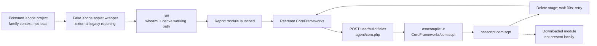

# XCSSET legacy loader overview

## Executive summary

The analyzed artifact is a compact, run-only AppleScript loader that repeatedly
retrieves and launches a server-supplied XCSSET module. It identifies the
current user, reports status to a masquerading Adobe-themed domain, recreates a
`CoreFrameworks` staging directory, streams server-returned AppleScript source
into `osacompile -x`, executes the resulting `com.scpt` with `osascript`, deletes
the stage and retries after 30 seconds.

The sample is high-confidence legacy XCSSET, but it is not the XCSSET v40
sample suggested by the initial research link. Unit 42 dates v40 activity to
2026 and describes rotating `.ru`/`.in` C2 infrastructure, AES-protected
in-memory module delivery and extensive polymorphism. The local sample instead
contains the `adobestats[.]com` infrastructure documented in Trend Micro's
original 2020 investigation and uses a simple disk-backed compiled stage.

## Sample profile

| Field | Value |
|---|---|
| SHA-256 | `6fa938770e83ef2e177e8adf4a2ea3d2d5b26107c30f9d85c3d1a557db2aed41` |
| MD5 | `3b0257a1a7e8b7e66840888db18be1cd` |
| SHA-1 | `c65988d03ad13a0bf889cddeacde3ba1638bd77b` |
| Size | 2,394 bytes |
| Format | Run-only compiled AppleScript, `FasdUAS 1.101.10` |
| Role | Initializer, module fetcher/compiler, launcher and retry loop |
| Embedded C2 | `adobestats[.]com` |

## Infection and execution chain

Dashed nodes are the external legacy family envelope. Solid nodes are recovered
directly from the local bytes.

Editable Mermaid sources are in [code/diagrams](code/diagrams/).

## Behavior

### Host and path initialization

`run` sets build metadata to `default` and `1`, invokes `whoami`, derives a
POSIX working directory relative to the applet and reports `module launched`.
The user value becomes both a custom `X-User` header and a form field in later
requests.

### C2 and module retrieval

The sample uses two HTTPS endpoints:

- `/agent/log.php` receives a status body and the `X-User` and `X-Module`
  headers. The module header is hardcoded to `Xcode`.
- `/agent/com.php` receives `user`, `build_vendor=default` and
  `build_version=1`, and returns source that is piped directly to
  `osacompile -x`.

Both requests use `curl -k`, disabling certificate verification. The log call
also uses a 10-second connection timeout. No encryption or application-layer
encoding is implemented in this loader.

### Staging and execution

Every cycle removes and recreates `<working directory>/CoreFrameworks`, writes
the compiled server response to `CoreFrameworks/com.scpt`, runs it through
`osascript`, suppresses its stdout/stderr and deletes the compiled stage. A
bare `try` in `boot` suppresses failures, waits 30 seconds and recurses.

This loader's effective capabilities are controlled by the absent server
response. Static analysis can prove the fetch/compile/execute mechanism, but
not the behavior of a module that was never embedded or retrieved.

## Detection priorities

1. Match the compiled AppleScript structure and stable UTF-16BE command
   combination with YARA.
2. Alert on shell commands that pipe `curl` output into `osacompile -x` beneath
   a `CoreFrameworks/com.scpt` path.
3. Detect `osascript` executing that stage and correlate the subsequent delete.
4. Retrospectively hunt `adobestats[.]com/agent/{com,log}.php`, while treating
   the aged domain as historical and potentially reassigned.
5. For modern v40 coverage, separately monitor network-capable processes
   launched from Xcode build phases and multi-pass decoder-to-`osascript`
   chains; do not combine the legacy and v40 IOC sets.

## Analyst confidence

| Finding | Confidence | Basis |
|---|---|---|
| Compiled AppleScript loader | High | Magic, FAS objects and bytecode |
| C2, endpoints and request fields | High | Embedded UTF-16BE literals and concatenation opcodes |
| Fetch/compile/run/delete loop | High | Complete handler disassembly |
| Legacy XCSSET attribution | High | Distinctive C2 and workflow align with original reporting |
| XCSSET v40 identity | Rejected | Architecture, endpoint scheme and infrastructure conflict |
| Downloaded module capabilities | Unknown | Payload absent; network access intentionally prohibited |

## Static-only limitations

- The applet wrapper, poisoned project and persistence components are absent.
- The C2 response and all downstream modules are absent.
- No process, file, memory or network behavior was observed dynamically.
- The `module finished` log follows a recursive loop and appears unreachable
  during normal execution, but runtime edge cases were not tested.

## References

- [Trend Micro — XCSSET technical brief](https://documents.trendmicro.com/assets/pdf/XCSSET_Technical_Brief.pdf)
- [Unit 42 — The Xcode Assassin Returns: XCSSET v40](https://unit42.paloaltonetworks.com/xcsset-v40-malware-analysis/)
- [MITRE ATT&CK — AppleScript](https://attack.mitre.org/techniques/T1059/002/)
